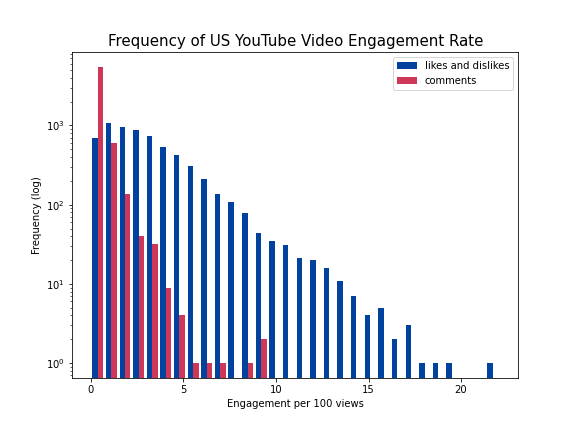
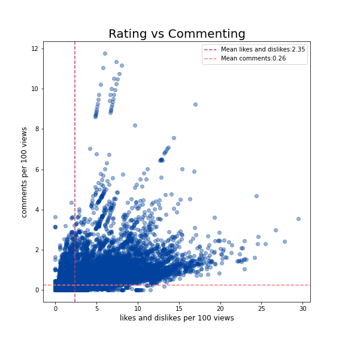
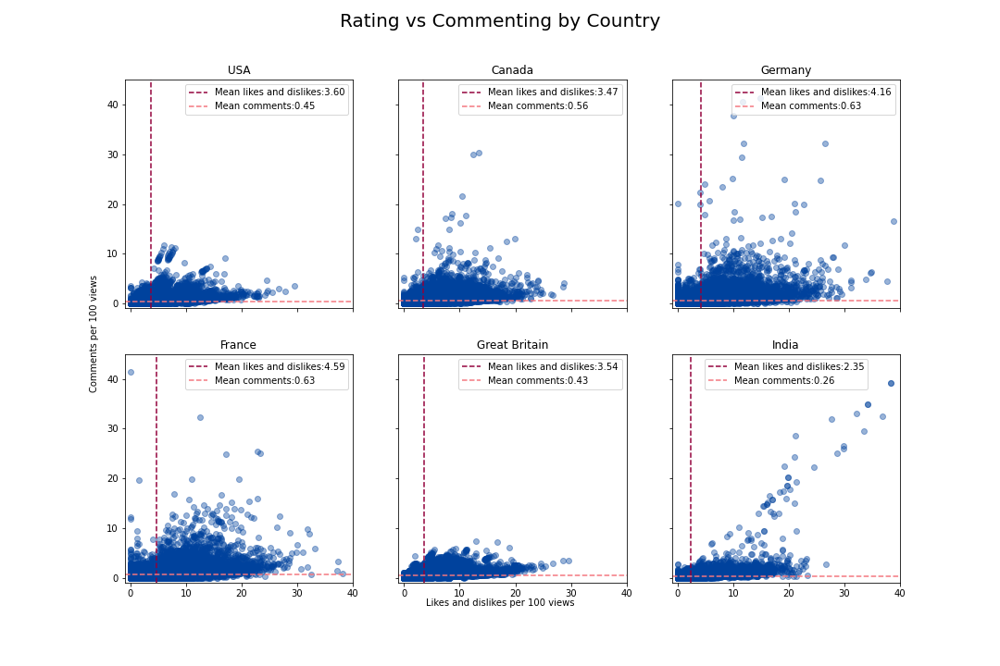
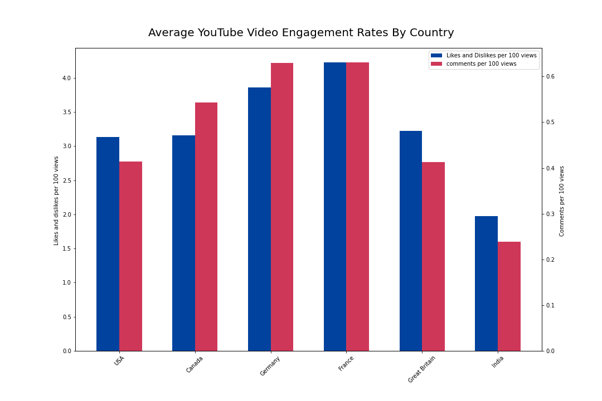
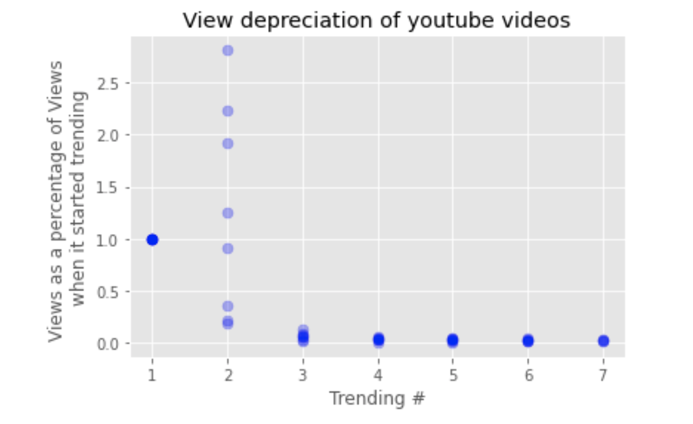

# Youtube Video Engagement

#### Isabella Sun and Josh Bernd

## Introduction
In this exploratory data analysi, we examined the Trending YouTube Video Statistics data. Specifically, we were interested in different measures of engagement on trending YouTube videos. 

## Data Description
The data describe a set of top-trending videos on the YouTube platform by various countries. The countries included in our analysis are:
    - United States
    - Great Britain
    - Canada
    - Germany
    - France
    - India

The main information included in the data were:
    - Trending Date
    - Video Title
    - YouTube Channel
    - Time the video was published
    - Category
    - Tags
    - Number of views
    - Number of likes
    - Number of dislikes
    - Number of comments
    
Since our focus for this project was engagement rates, our three most important variables were likes, dislikes, and comments. To normalize engagement rates, we divided the total number of likes and dislikes by the number of views, and the number of comments by the number of views. The data are based on daily top trending YouTube videos, so a video that is trending for multiple days will appear multiple times in the data. We examined the engagement and views for the most recent date that a video was trending. 

### Missing/Excluded Data
For the purposes of this project we removed any observations where comments and/or likes and dislikes were disabled for the video and any videos that had an error or were removed from our analysis. In total, there were only 23 videos that were removed or had an error in the US dataset and 696 videos with comments or likes disabled in the US dataset. 

## Analysis

First, we take a look at the top performing videos by our measures of engagement.

Below we have the top 10 videos with the highest likes and dislikes per view. It appears that these videos tend to be music/music video type videos. 

|    | Video Title                                    |   Likes and dislikes/view |
|---:|:-----------------------------------------------|--------------------------:|
|  1 | Shawn Mendes: The Tour - Official Trailer      |                  0.220729 |
|  2 | PSA from Chairman of the FCC Ajit Pai          |                  0.197397 |
|  3 | CRISTIANO RONALDO E FRED, O GRANDE ENCONTRO    |                  0.189541 |
|  4 | GOALS GOALS GOALS                              |                  0.18375  |
|  5 | Niall Horan - On The Loose (Lyric Video)       |                  0.173013 |
|  6 | Harry Styles - Kiwi (live in studio)           |                  0.17093  |
|  7 | BTS Takes on L.A. - Vogue                      |                  0.170105 |
|  8 | BTS (방탄소년단) 'FAKE LOVE' Official Teaser 2    |                  0.164283 |
|  9 | THINGS THAT ARE LOWER                          |                  0.163864 |
| 10 | From Dream to Reality                          |                  0.160991 |

Below we present the top 10 videos with the highes comments per view. They appear to commonly be makeup related content as opposed to music related content. 

|    | Video Title                                                |   Comments/View     |
|---:|:-----------------------------------------------------------|--------------------:|
|  1 | FULL FACE USING 7-ELEVEN MAKEUP!                           |           0.0941438 |
|  2 | NEW WET N WILD 'GOTH-O-GRAPHIC' COLLECTION - HIT OR MISS?! |           0.0882932 |
|  3 | FULL FACE OF MAKEUP IM THROWING OUT 2018                   |           0.0861341 |
|  4 | #ProudToCreate: Pride 2018                                 |           0.0679747 |
|  5 | STRANGERS DO MY MAKEUP ON HOLLYWOOD BOULEVARD              |           0.064245  |
|  6 | BEST MAKEUP OF 2017!                                       |           0.054504  |
|  7 | $11.99 FOUNDATION VS. $40 FOUNDATION: Who Wins ???         |           0.0508288 |
|  8 | Melting Every Lipstick From Sephora Together               |           0.0501962 |
|  9 | You, but in emojis. (YIAY #375)                            |           0.0474712 |
| 10 | 18 MILLION SUBSCRIBERS!!!!                                 |           0.0459858 |

The differing sets of videos that rank the highest by the two definitions of engagement suggests that videos that garner lots of likes and dislikes will not necessarily have high rates of comments per view and visa versa. 

Looking at the top 10 channels with the highest rates of likes/dislikes per view and the top 10 channels with the highest comments per view, we see a similar pattern to the top videos by engagement type. There is no overlap between the two sets of top 10 channels using different measures of engagement. This further supports the observation that high levels of engagement in the form of likes and dislikes is not necessarily indicative of high rates of commenting. 

|    | Channel.         |   Likes and dislikes/view |
|---:|:-----------------|--------------------------:|
|  1 | Daily Caller     |                  0.197397 |
|  2 | Desimpedidos     |                  0.189541 |
|  3 | KickThePj        |                  0.18375  |
|  4 | Amber Liu        |                  0.163864 |
|  5 | Max Joseph       |                  0.160991 |
|  6 | Scotty Sire      |                  0.143784 |
|  7 | Caspar           |                  0.141834 |
|  8 | ConnorFranta     |                  0.139945 |
|  9 | Smyang Piano     |                  0.137142 |
| 10 | Henry Prince Mak |                  0.128749 |

|    | Channel                 |  Comments/view.     |
|---:|:------------------------|--------------------:|
|  1 | Manny Mua               |           0.0494561 |
|  2 | GingerPale              |           0.0422106 |
|  3 | Bethany Mota            |           0.039281  |
|  4 | Jessii Vee              |           0.0366854 |
|  5 | Caravan Carolyn         |           0.034887  |
|  6 | Mark Ferris             |           0.031746  |
|  7 | RawBeautyKristi         |           0.0316663 |
|  8 | Laura Lee               |           0.0302555 |
|  9 | DanTDM                  |           0.02969   |
| 10 | Jessica Kellgren-Fozard |           0.0291707 |

This figure shows the frequency of videos with different engagement rates. From this graph, it appears that there are many videos with no comments. It is more common for a video to have a few likes and/or dislikes than to have no likes or dislikes. This is expected as the effort involved in engaging by commenting on a video is much higher than liking or disliking a video. Generally, there are fewer videos with higher rates of engagement. Interestingly, the frequency of videos with more comments per view increases slightly as the rate of commenting increases from about 6 comments per 100 views to 10 comments per 100 views. 

#### Relationship between the different measures of engagement

We also examined the realtionship between the measures of engagement. The correlation between likes and dislikes per view and comments per view is **0.44**

However, we might observe a stronger relationship if we were to remove the outliers as it appears that there are a number of videos with high levels of commenting.

### Engagement Rates by County

Exploring the relationship between the two measures of engagement by country also appears to show only a weak relationship between a video getting likes/dislikes or getting comments. Where most countries see a few outliers either in the direction of high rates of commenting but low rates of liking/disling or high rates of liking/disliking but low rates of commenting. The exception is in India where it appears that the viral videos with exceptional rates of likes/dislikes also garner higher rates of commenting as well. 

 

Below we present the average YouTube Video Engagement rates by Country. Some countries like Germany and France have higher average rates of engagement where India has relatively low average rates of engagement. 

 

### Visualizing Video View Depreciation

An interesting feature of these data sets was that video data was entered each time the video trended. We wanted to see how a video's trending impacted new views.

 
